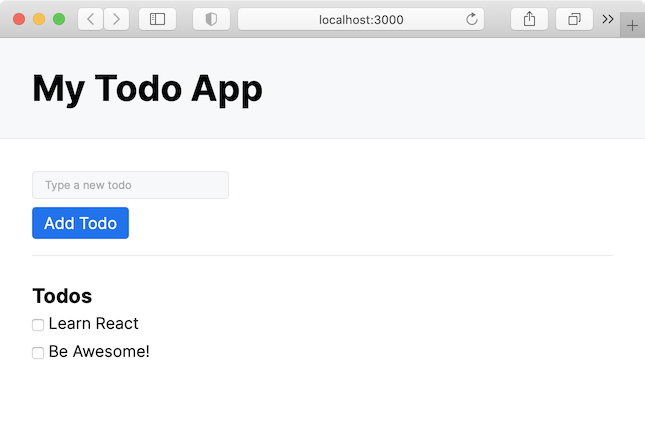

# 1: Getting Started with React

## Learning Objectives

Today's goal is to set up the structure of our application and end up with a basic, static page.

## Your Mission

### Step 1. Installation

Create a folder for this project (I suggest you call it `intro-react` or `react-todolist`). Inside this folder, type the following command to start a **Vite** project :

`npm create vite`

Then, select your :
1. Project name
2. Framework (choose React)
3. Variant (select Javascript)

*Note : React used to have its own CLI project bundler : **react-create-app**, but it's been since deprecated. The closest modern way to simply create a React project is [Vite](https://vitejs.dev/guide/), but the React docs has some other options, like [Next.js](https://nextjs.org/docs/getting-started/installation).*

The installation may take a few seconds. At the end you will see a recap in your terminal with a few commands you now need to run to build and start your project :

1. `cd your_project_name` : Self explanatory : navigate to your project in the terminal
2. `npm install` : Vite provides a _package.json_ file with the required dependencies for React (with React itself in it). You still need to install them to make it work ! It might take a few minutes depending on your internet connection to download and install everything, so be patient.
3. `npm run dev` will execute the **dev** script from the _package.json_ file, which is `vite` in our case. Once done, it will show on which localhost port you can browse your shiny new React app !

### Step 2. Git

I shouldn't be saying it but... `git init`, commit, push etc.!

Don't forget to create a .gitignore file, to remove the _/node_modules_ from your version control.

### Step 3. Start! And code...

Once you run the following command:

`npm run dev`

and access your first React app (with Vite, it should be on [http://localhost:5173](http://localhost:5173)) you should see the **Vite + React** title. Yay!

Try to change something in the file `App.jsx`. For example, change the line that says

`Vite + React`

to

`Learn React @ BeCode`

and save. The browser will immediately reload with the new version. Isn't that cool?

### Step 4. Time to do some real work

Up until now, you have been served everything. It's time to code.

Your goal for today is to create the components that form the app. You are creating a static skeleton with a fixed list of todos. Tomorrow we will see how to make it interactive. Here is what it should look like, structure-wise:

Note: it doesn't have to look _identical_ (I used the [new.css](https://newcss.net/) CSS framework by the way, in case you are interested), but it does need to have the following features:

- an input field to type new todos
- a submit button
- a list of todos (just add 2-3 todos)
- each todo has a checkbox next to it

#### Components

These elements could be divided in **React components**. Like you divide your html pages into sections, articles... In React, you divide your work in **components**. 

At this stage of your project, I'll ask you to create a different component for the list of todos. Create a different file, call it "*TodoList*" (the convention is that the filename is equal to the component name), and use the `import`/`export` syntax to import it into the `App.jsx` file.  

Note : `.js` or `.jsx` ? In theory, JSX files are **React** files that will render JSX. You can use React is `.js` files because your bundler (Vite, in our case) will compile them to vanilla JavaScript anyway, but it might be simpler for your code editor or IDE to recognize React if you use the `.jsx` format.

### Step 5.

Done?

If you think you are done, push your changes to GitHub, build and deploy the app on Netlify, and also do not forget : help others understand what you've learned today!

## Good Luck!
